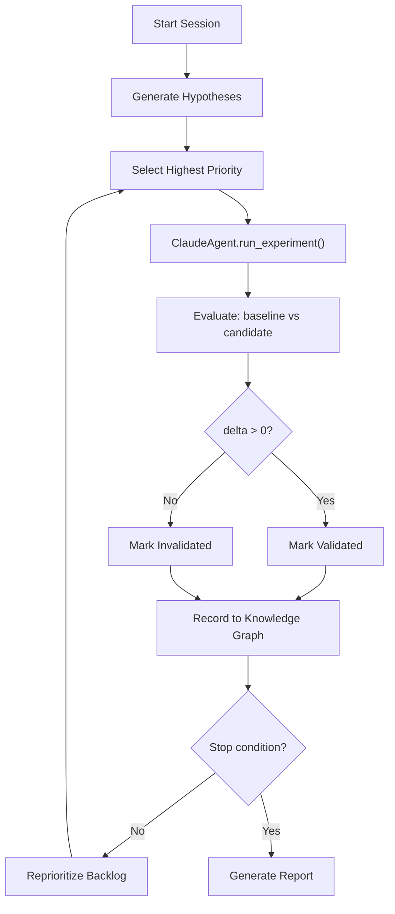

# Experiment and Hypothesis Playbook

> A practical guide to running scoring experiments with the Widby research agent.
> For architecture details, see [docs/research_agent_design.md](research_agent_design.md).

---

## 1. What is the Research Agent?

The research agent is an autonomous scoring-improvement system. It analyzes your niche scoring data, identifies weak scoring dimensions, generates testable hypotheses, and runs controlled experiments to determine whether parameter changes improve opportunity scores. The agent uses Claude's native tool-use to reason about which tools to call, produces real candidate scores via the M7 scoring engine, and records every outcome in a persistent knowledge graph so learnings compound across sessions.

---

## 2. Core Concepts

### Scoring Proxies

Every metro is scored across five dimensions (0--100 each), which combine into a composite **opportunity** score:

| Proxy | Weight | What It Measures |
|-------|--------|------------------|
| `demand` | 25% | Search volume, breadth, transactional intent |
| `organic_competition` | 20% | Domain authority, local business presence, site quality |
| `local_competition` | 15% | Review counts, review velocity, GBP completeness |
| `monetization` | 20% | CPC, business density, LSA/ads presence |
| `ai_resilience` | 15% | AIO trigger rate, transactional keyword ratio, PAA density |
| **`opportunity`** | composite | Weighted combination of the above |

Weights and thresholds live in `src/config/constants.py`.

### Hypothesis

A testable claim about how changing a scoring parameter will affect results. Example: *"Reducing the organic_competition ceiling from 70 to 60 will raise opportunity scores in metros where competition is low."*

Each hypothesis targets one proxy, specifies an expected direction (increase or decrease), and carries a priority (1 = highest).

### Experiment

A single test of one hypothesis. The Claude agent reasons about which tools to call, executes parameter modifications via the scoring plugin, and produces candidate scores. Each experiment generates an auditable record of every tool call, its arguments, result, cost, and latency.

### The Ralph Loop

The iterative outer structure that drives the research session. Named after the **R**eason-**A**ct-**L**earn-**P**rioritize-**H**alt pattern:



### Validation

An experiment is **validated** when the mean composite `opportunity` score across all metros improves (delta > 0). Otherwise it is **invalidated**. Both outcomes are valuable: validated results become recommendations; invalidated results prune the search space and are stored in the knowledge graph to prevent repeating the same dead ends.

---

## 3. Three Ways to Run Experiments

### CLI (local development)

```bash
python -m src.research_agent.run_research_agent \
  --scoring-input scores.json \
  --max-iterations 5 \
  --budget 10.0 \
  --graph-path research_graph.json \
  --output report.md
```

| Flag | Default | Purpose |
|------|---------|---------|
| `--scoring-input` | demo data | Path to JSON file with scoring results |
| `--run-id` | random 8-char ID | Identifier for this run |
| `--max-iterations` | 10 | Hard cap on experiment count |
| `--budget` | 50.0 | Max API spend in USD |
| `--graph-path` | None | Persistent knowledge graph path (enables dedup across runs) |
| `--output` | stdout | File path for the markdown report |

Omit `--scoring-input` to run against built-in demo data (3 metros: Phoenix, DC, Atlanta).

### API (dashboard / integration)

```bash
curl -X POST https://whidby-1.onrender.com/api/sessions \
  -H "Content-Type: application/json" \
  -d '{
    "scoring_results": null,
    "max_iterations": 3,
    "budget_limit_usd": 10.0
  }'
```

Pass `scoring_results: null` (or omit it) for demo data. The response includes `run_id`, `report`, `recommendations`, and `outcome`.

### Chat (ad-hoc hypothesis)

```bash
curl -X POST https://whidby-1.onrender.com/api/chat \
  -H "Content-Type: application/json" \
  -d '{"message": "What if we penalize metros with low review velocity more aggressively?"}'
```

This generates a single **novel hypothesis** (does not run a full session). Use it to explore ideas before committing to a full run.

---

## 4. Your First Experiment

### Step 1: Start with demo data

```bash
python -m src.research_agent.run_research_agent --max-iterations 2 --budget 5.0
```

### Step 2: What happens

1. The system loads 3 demo metros with pre-set scores.
2. `generate_hypotheses()` identifies the weakest proxies. For the demo data, `organic_competition` averages ~43 (lowest), so hypotheses target that proxy first.
3. For each hypothesis, the Claude agent calls `rescore_with_modifications` to test parameter changes against the baseline.
4. The evaluator compares baseline vs. candidate composite scores.
5. A markdown report summarizes findings.

### Step 3: Reading the output

The API returns JSON with this shape:

```json
{
  "run_id": "7d8dc717",
  "report": "# Research Agent Improvement Report\n\n## Summary\n...",
  "recommendations": [],
  "outcome": {
    "run_id": "7d8dc717",
    "iterations_completed": 2,
    "stop_reason": "max_iterations",
    "total_cost_usd": 0.0,
    "validated_count": 0,
    "invalidated_count": 2,
    "results": [
      {
        "iteration": 1,
        "hypothesis_id": "eb917567",
        "experiment_id": "7fb56082",
        "baseline_score": 67.33,
        "candidate_score": 65.10,
        "delta": -2.23,
        "validated": false,
        "cost_usd": 0.0,
        "learning": "Composite score degraded: 67.33 -> 65.10 (delta: -2.23)...",
        "timestamp": "2026-04-06T05:06:41Z"
      }
    ]
  }
}
```

Key fields:

| Field | Meaning |
|-------|---------|
| `stop_reason` | Why the loop ended: `max_iterations`, `budget_exceeded`, `convergence`, or `backlog_empty` |
| `validated_count` | How many experiments improved the composite score |
| `invalidated_count` | How many experiments did not improve it (still useful data) |
| `results[].delta` | Score change (positive = improvement) |
| `results[].learning` | Human-readable summary including per-proxy breakdown |
| `results[].cost_usd` | API cost for this experiment ($0.00 for fast-mode re-scoring) |

### Step 4: Understanding "invalidated"

Invalidated experiments are not failures. They are evidence that a particular parameter change does not help. The system records them in the knowledge graph so that:

- Future runs skip invalidated hypothesis titles (graph dedup).
- You can trace what was tried and why it didn't work.
- The backlog reprioritizes away from approaches that have been disproven.

---

## 5. Providing Real Scoring Data

The system expects a JSON file with this schema:

```json
{
  "metros": [
    {
      "cbsa_code": "38060",
      "cbsa_name": "Phoenix-Mesa-Chandler, AZ",
      "scores": {
        "demand": 72,
        "organic_competition": 45,
        "local_competition": 58,
        "monetization": 81,
        "ai_resilience": 92,
        "opportunity": 71
      }
    }
  ]
}
```

**More metros = richer experiments.** The evaluator compares composite scores across all metros, so a single metro gives one data point while 10+ metros provide statistical variance.

### Adding signals for full-mode experiments

If you include per-metro `signals` from the M5/M6 pipeline, the scoring plugin can run `rescore_with_modifications` with real signal overrides:

```json
{
  "metros": [
    {
      "cbsa_code": "38060",
      "cbsa_name": "Phoenix-Mesa-Chandler, AZ",
      "scores": { "demand": 72, "...": "..." },
      "signals": {
        "effective_search_volume": 14500,
        "volume_breadth": 0.72,
        "transactional_ratio": 0.45,
        "avg_top5_da": 38,
        "local_biz_count": 12,
        "avg_lighthouse_performance": 55,
        "local_pack_review_count_avg": 45.0,
        "review_velocity_avg": 2.1,
        "gbp_completeness_avg": 0.7,
        "avg_cpc": 12.50,
        "business_density": 0.8,
        "lsa_present": false,
        "aio_trigger_rate": 0.15,
        "transactional_keyword_ratio": 0.6,
        "paa_density": 0.3
      }
    }
  ]
}
```

Without `signals`, the scoring plugin operates on scores alone, which limits what parameter modifications can be tested.

---

## 6. Crafting Custom Hypotheses

### Auto-generated hypotheses

When you start a session, `generate_hypotheses()` automatically:

1. Averages each proxy score across all metros.
2. Ranks proxies from lowest to highest.
3. Creates hypotheses using scripted approach patterns for each weak proxy.

Approach patterns include `weight_adjustment`, `threshold_change`, `signal_reinterpretation`, `data_source_comparison`, and `composite_interaction`.

### Novel / manual hypotheses

Use the chat endpoint to propose a hypothesis from free text:

```bash
curl -X POST https://whidby-1.onrender.com/api/chat \
  -H "Content-Type: application/json" \
  -d '{"message": "What if we weight review velocity 2x higher for local competition?"}'
```

**Good hypothesis messages** are specific and testable:

| Message | Quality |
|---------|---------|
| "Increase the monetization weight from 0.20 to 0.30 and reduce demand to 0.15" | Specific, testable |
| "Penalize metros where avg_cpc is below $5" | Clear signal and threshold |
| "Make the scores better" | Too vague, no testable parameter |
| "What about competition?" | Too broad, no direction |

### Hypothesis fields

| Field | Type | Meaning |
|-------|------|---------|
| `id` | string | Unique 8-char identifier |
| `title` | string | One-line summary |
| `description` | string | Detailed explanation |
| `target_proxy` | string | Which proxy this tests (`demand`, `organic_competition`, etc., or `composite`) |
| `approach` | string | Method: `weight_adjustment`, `threshold_change`, `novel_exploration`, etc. |
| `expected_direction` | string | `increase` or `decrease` |
| `priority` | int | 1 (highest) to N (lowest) |
| `status` | string | `pending` -> `in_progress` -> `validated` or `invalidated` |

---

## 7. What the Agent Does (Tools and Plugins)

Claude decides which tools to call based on the hypothesis. Four plugin categories are available:

| Plugin | Tool | When Used | Cost |
|--------|------|-----------|------|
| **Scoring** | `rescore_with_modifications` | Parameter-only experiments (fast mode) -- the default | $0.00 |
| **DataForSEO** | `fetch_serp_organic`, `fetch_keyword_volume`, `fetch_business_listings`, `fetch_google_reviews`, `fetch_backlinks_summary`, `fetch_lighthouse`, etc. | Full mode -- when fresh external data is needed | Real API cost |
| **MetroDB** | `expand_geo_scope` | Adding new metros to the experiment scope | $0.00 |
| **LLM** | `expand_keywords`, `classify_search_intent`, `llm_generate` | Enriching keyword or intent data | API cost |

### Fast mode vs. full mode

- **Fast mode (default):** Claude calls `rescore_with_modifications` directly. This re-runs M7 `compute_batch_scores()` with modified parameters against baseline signals. Instant, zero cost, and sufficient for testing weight/threshold changes.
- **Full mode:** Claude calls DataForSEO tools to gather fresh data, then scores the results. This tests hypotheses that require new data (e.g., "expand to 5 more metros" or "pull fresh keyword volumes"). Incurs real API cost.

Claude is instructed to prefer fast mode unless the hypothesis requires fresh data.

---

## 8. Reading Your Artifacts

Every run writes artifacts to disk:

```
research_runs/{run_id}/
├── progress.jsonl              # Append-only timeline of events
├── backlog.json                # Hypothesis queue with current statuses
├── loop_state.json             # Resumable checkpoint (iterations, cost, stop reason)
├── snapshots/
│   └── baseline.json           # Original scoring data
└── experiment_results/
    ├── {experiment_id_1}.json   # Full experiment record with tool_calls audit log
    └── {experiment_id_2}.json
```

Additionally, a global knowledge graph is maintained at the path specified by `--graph-path` (or the `RESEARCH_GRAPH_PATH` environment variable, defaulting to `research_graph.json`).

### Inspecting artifacts

**List all runs:**

```bash
curl https://whidby-1.onrender.com/api/sessions
```

**Get full run detail:**

```bash
curl https://whidby-1.onrender.com/api/sessions/{run_id}
```

Returns progress entries, backlog state, experiment IDs, and snapshot names.

**Get experiment results for a run:**

```bash
curl https://whidby-1.onrender.com/api/experiments/{run_id}
```

Each experiment record includes `modifications`, `candidate_scores`, `cost_usd`, and the full `tool_calls` audit log with timestamps and latencies.

### Querying the knowledge graph

**Full graph:**

```bash
curl https://whidby-1.onrender.com/api/graph
```

Returns all nodes (hypotheses, experiments, recommendations) and edges (supports, contradicts, derived_from).

**Node neighborhood:**

```bash
curl https://whidby-1.onrender.com/api/graph/{node_id}/neighborhood?depth=2
```

Returns the center node, its neighbors within the given depth, and connecting edges.

---

## 9. Budget and Stop Conditions

The Ralph loop stops when any of these conditions is met:

| Condition | Default | How to Configure |
|-----------|---------|------------------|
| Max iterations reached | 10 | `--max-iterations` (CLI) or `max_iterations` (API) |
| Budget exceeded | $50.00 | `--budget` (CLI) or `budget_limit_usd` (API) |
| Convergence | 3 consecutive deltas < 0.01 | `LoopConfig.convergence_window` / `convergence_threshold` |
| Backlog empty | All hypotheses tested | Automatic (no config) |

**Budget tracking** operates at two levels:

1. **Loop level:** The Ralph loop sums `cost_usd` from each experiment and halts when the total exceeds the budget.
2. **Agent level:** The Claude agent tracks cost within a single experiment and stops calling tools if the next call would exceed the remaining budget.

Fast-mode experiments (`rescore_with_modifications`) cost $0.00, so budget only matters when DataForSEO or LLM tools are called.

---

## 10. Interpreting the Report

The final markdown report includes:

```markdown
# Research Agent Improvement Report

## Summary
- Total experiments run: 5
- Validated improvements: 2
- Total API cost: $3.42
- Recommendations generated: 2

## Recommendations (by priority)

### 1. Apply changes from experiment abc12345
- **Impact:** +4.2 composite score improvement
- **Confidence:** high
- **Evidence:** Composite score improved: 67.33 -> 71.53 (delta: +4.20)
  Evaluated across 3 metros.
  Per-proxy breakdown:
    demand: 75.0 -> 78.2 (+3.2)
    organic_competition: 43.3 -> 48.1 (+4.8)
    ...
```

**Confidence labels** indicate how reliable the result is:

| Label | Meaning | Graph action |
|-------|---------|-------------|
| `high` | Large delta, consistent across metros | Promoted to graph as recommendation |
| `medium` | Moderate delta or some variance | Promoted to graph as recommendation |
| `low` | Small delta or high variance | Recorded but not promoted |

Recommendations are sorted by `priority_score = abs(delta) * confidence_multiplier`, so the highest-impact, most reliable improvements appear first.

---

## 11. Tips and Troubleshooting

### "All experiments invalidated"

This is normal, especially with demo data or scores-only input. The scoring plugin needs per-metro `signals` (from M5/M6) to meaningfully test parameter modifications. With only `scores`, the plugin has limited inputs to work with. Provide real pipeline data with the `signals` field for richer experiments.

### "candidate_score is 0.0"

This usually means one of:

- The baseline data had no `signals` field, so the scoring plugin received empty inputs.
- Claude did not call `rescore_with_modifications` during the experiment (check the `tool_calls` in the experiment result).
- The modifications produced invalid signal values that the scoring engine rejected.

Check `research_runs/{run_id}/experiment_results/{experiment_id}.json` for the full tool call log.

### Cost is always $0.00

If every experiment shows zero cost, the agent is exclusively using fast-mode `rescore_with_modifications`. This is by design for parameter-only hypotheses. Full-mode experiments that call DataForSEO will show real costs.

### Graph dedup across runs

When you provide `--graph-path` (CLI) or rely on the `RESEARCH_GRAPH_PATH` env var, the system checks invalidated hypothesis titles before generating new ones. This prevents repeating experiments that have already been disproven. If you want a fresh start, use a new graph path or omit the flag.

### Increasing experiment variety

- Add more metros to your scoring input -- more data points give the evaluator better signal.
- Include the `signals` field from your M5/M6 pipeline output.
- Use the chat endpoint to propose novel hypotheses that the auto-generator wouldn't think of.
- Increase `--max-iterations` to let the agent explore more of the hypothesis space.

---

## Quick Reference

### API endpoints

| Method | Path | Purpose |
|--------|------|---------|
| `POST` | `/api/sessions` | Start a research session |
| `GET` | `/api/sessions` | List all runs |
| `GET` | `/api/sessions/{run_id}` | Get run detail |
| `POST` | `/api/chat` | Generate a single hypothesis |
| `GET` | `/api/graph` | Full knowledge graph |
| `GET` | `/api/graph/{node_id}/neighborhood` | Node neighborhood |
| `GET` | `/api/experiments/{run_id}` | Experiment results for a run |
| `GET` | `/health` | Liveness check |

### Source files

| Component | Location |
|-----------|----------|
| Hypothesis generation | `src/research_agent/hypothesis/generator.py` |
| Experiment planning | `src/research_agent/hypothesis/experiment_planner.py` |
| Ralph loop | `src/research_agent/loop/ralph_loop.py` |
| Claude agent | `src/research_agent/agent/claude_agent.py` |
| Scoring plugin | `src/research_agent/plugins/scoring_plugin.py` |
| Evaluator | `src/research_agent/evaluation/evaluator.py` |
| Recommendations | `src/research_agent/recommendations/recommender.py` |
| API bridge | `src/research_agent/api.py` |
| CLI entrypoint | `src/research_agent/run_research_agent.py` |
