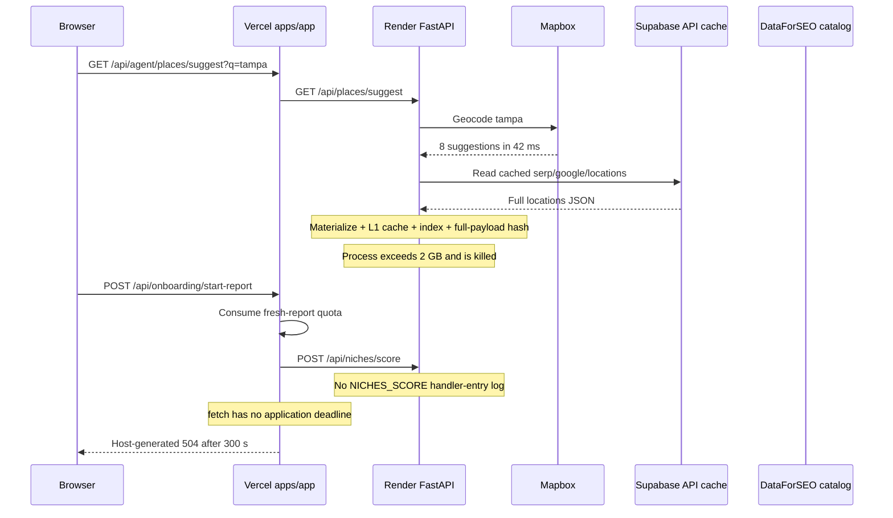
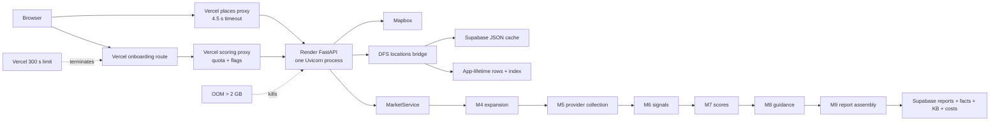
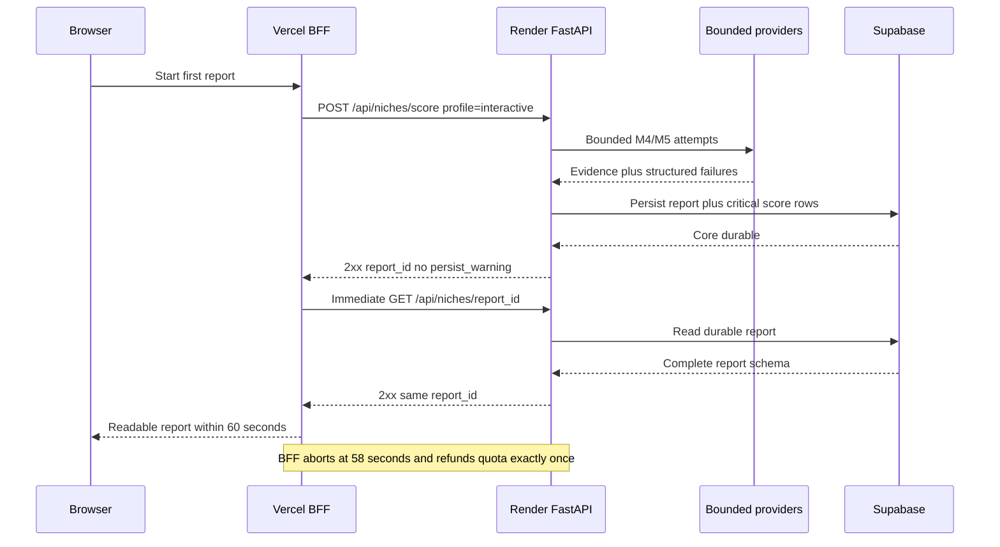

# Whidby Backend Execution and Render Memory Reliability Review

- **Status:** Review artifact — production OOM confirmed; autocomplete catalog causal link high-confidence; implementation and acceptance not yet verified
- **Date:** 2026-07-11
- **Scope:** Consumer onboarding, place autocomplete, Vercel BFF routes, Render FastAPI, M4-M9 scoring, persistence, and production operations
- **Decision requested:** Execute and measure the bounded synchronous first-report remediation; treat infrastructure scaling only as temporary containment

## Executive conclusion

The strongest supported explanation for the recurring Render out-of-memory failure is the place-autocomplete catalog regression, not an M4-M9 allocation. This is a high-confidence causal link: production sequence, code, and prior regression history agree, but no heap snapshot from the failed process proves exact byte ownership.

`GET /api/places/suggest` enriches Mapbox suggestions by hydrating the entire DataForSEO Google locations catalog through the shared persistent cache. A prior fix, commit `42f4ac9`, removed this exact bridge because it downloaded approximately 226,000 rows and consumed approximately 2 GB when parsed on Render. Commit `6ba4cf9` later reintroduced the bridge behind `asyncio.wait_for(..., timeout=1.5)`. That timeout does not protect the service because the Supabase cache lookup and JSON materialization are synchronous and block the event loop before cancellation can run.

The high-confidence causal reconstruction is therefore:

```text
Place autocomplete
  -> Mapbox succeeds in 42 ms
  -> DataForSEO locations cache is read from Supabase
  -> the full catalog is materialized, cached, indexed, and hashed
  -> Render process exceeds 2 GB and is killed
  -> the scoring POST never enters NICHES_SCORE
  -> Vercel waits without an upstream deadline
  -> Vercel terminates onboarding at 300 seconds with HTTP 504
  -> UI displays “Report could not be started.”
```

The accepted response is layered:

1. **Stop the high-confidence trigger path:** remove or gate DataForSEO catalog enrichment from interactive autocomplete and return Mapbox-only suggestions. The product already has MetroDB/state fallbacks for scoring.
2. **Bound the customer pipeline:** use an explicit `interactive` profile with one volume batch, at most six eligible organic SERPs, one maps SERP, GBP info, business listings, no per-keyword LLM fanout, at most ten provider calls, and concurrency capped at eight.
3. **Bound process memory and retained state:** exclude the locations catalog from request caches and hashing, cap L1 at 128 entries and 2,000,000 bytes per admitted value, reuse provider clients, and drain cost records by collection context.
4. **Persist core-first:** synchronously write only the durable report and critical score rows for `interactive`; cost, KB, feedback, and generated-guidance work cannot block the response or move to an untracked in-process task.
5. **Enforce the customer deadline:** target 55 seconds inside FastAPI, abort the BFF request and refund consumed quota at 58 seconds, and require the POST plus immediate schema-valid GET to finish under one shared `<= 60.0`-second deadline.

The accepted memory ceiling is cgroup v2 `memory.peak <= 500000000` bytes. Increasing the Render plan can be temporary incident containment, but it is not remediation evidence and does not alter the `memory.peak <= 500000000` acceptance gate. Increasing Vercel's timeout or adding instances likewise cannot substitute for a durable, immediately readable report inside the hard boundary.

## Evidence standard

This document distinguishes three evidence levels:

- **Confirmed:** directly observed in production logs/events or current code/history.
- **High-confidence causal link:** the production sequence, code path, and prior identical regression agree, but no heap snapshot exists for the failed process.
- **Design risk:** code can amplify memory or latency, but it was not the first trigger in this incident.

## Measured performance baseline

These measurements are confirmed for their stated local live-provider or synthetic boundaries. They are not the authoritative production-image POST/read acceptance test and must not be presented as current compliance.

| Evidence level | Measurement | Boundary and interpretation |
| --- | --- | --- |
| Confirmed local live-provider integration | Cold-ish M4-M9 pytest wall time `96.38s`; max RSS `154386432` bytes; measured peak footprint `219236736` bytes | Excludes FastAPI and persistence. Latency already exceeds the complete `60.0s` product boundary, but the memory sample does not reproduce the autocomplete OOM. |
| Confirmed local live-provider integration | Warm M4-M9 pipeline `45.87s`; max RSS `223150080` bytes; M4 `29.11s`; M5 `16.27s` | Demonstrates that M4 serial work dominates the warm path and leaves too little room for FastAPI, core persistence, and immediate read. |
| Confirmed integration observation | The configured M4 default model is unavailable, causing approximately 50 serial Haiku intent calls | Explains the observed M4 amplification; exact production contribution still requires the authoritative stage trace. |
| Confirmed local synthetic measurement | M6-M9 over a synthetic 40-MB M5 payload completed in approximately 9 ms below 80 MB RSS | Rules out pure deterministic M6-M9 computation as the primary measured bottleneck; it does not measure provider or persistence work. |
| Confirmed production event | The Render autocomplete process used more than 2 GB and was killed on July 10, with the same class of event on July 8 | Establishes the recurring production memory incident, separately from the local M4-M9 samples. |

The unoptimized authoritative baseline will be captured later by the production-image harness. Until that redacted result exists, the exact FastAPI-plus-persistence latency and cgroup peak for one scoring request remain unverified.

## Production incident timeline

The following was captured from the authenticated Render and Vercel production dashboards on 2026-07-11.

| Time | Layer | Evidence | Interpretation |
| --- | --- | --- | --- |
| Jul 10, 12:59:22 PM | Render `jghfd` | `PLACES_SUGGEST START` for `ta` and `tampa` | The user's market autocomplete reached the production FastAPI process. |
| Jul 10, 12:59:22 PM | Render `jghfd` | Mapbox returned `200`; `tampa` completed in 42 ms | Mapbox was healthy and is ruled out as the slow stage. |
| Jul 10, 12:59:24 PM | Render `jghfd` | Supabase read for `api_response_cache`, endpoint `serp/google/locations` | The process entered bulk DataForSEO location-catalog hydration. |
| Immediately after | Render `jghfd` | No `PLACES_SUGGEST DONE`, bridge-loaded, or `NICHES_SCORE START` log | The process did not complete enrichment or enter the scoring handler. |
| Jul 10, 1:00 PM | Render | Autoscaler added a second instance | The platform reacted to pressure, but this could not rescue the in-flight process. |
| Jul 10, 1:06 PM | Render `jghfd` | Instance failed: “Ran out of memory (used over 2GB) while running your code.” | Direct infrastructure failure. |
| Jul 10, 1:07 PM | Render | Service recovered | A replacement/remaining instance restored service, not the lost request. |
| Same workflow | Vercel | `POST /api/onboarding/start-report`, request `050ff147-dcae-49ec-90be-2ecc79cdf6f3`, ended at 300 seconds with HTTP 504 | The BFF kept waiting for scoring after the upstream service became unavailable or blocked. |

Render also records the same over-2-GB instance failure on July 8. This is recurring, not a one-off platform event.

## Root-cause trace

### Backward trace from the user-visible error



### Exact code path

| Step | Code | Memory/availability effect |
| --- | --- | --- |
| Browser autocomplete | `apps/app/src/lib/niche-finder/place-suggest.ts:47` | Calls the bounded Vercel places proxy and already supports a CBSA fallback. |
| Vercel places proxy | `apps/app/src/app/api/agent/places/suggest/route.ts:57` | Uses a 4.5-second upstream abort and a bounded 200-entry cache. This layer is not the OOM source. |
| FastAPI autocomplete | `src/research_agent/api.py:492` | Fetches Mapbox, then invokes the DataForSEO bridge at line 552. |
| Ineffective timeout | `src/research_agent/api.py:570` | Wraps enrichment in a 1.5-second `asyncio.wait_for`. Cancellation cannot run while synchronous cache I/O blocks the event loop. |
| App-lifetime client | `src/research_agent/api.py:118` | A shared `DataForSEOClient` and bridge live for the entire Uvicorn process. |
| Full catalog lookup | `src/research_agent/places.py:308` | Calls `DataForSEOClient.locations()` and retains city rows plus a city index for one hour. |
| Generic persistent cache | `src/clients/dataforseo/persistent_cache.py:48` | Synchronously selects the full JSONB `response_data`, then puts it into the L1 memory cache. |
| Unbounded L1 | `src/clients/dataforseo/cache.py:11` | TTL-only dictionary has no entry-count or byte limit and evicts expired values only when that same key is read. |
| Full-payload hash | `src/clients/dataforseo/client.py:508` | `_response_hash` serializes the entire response to JSON bytes, creating a large transient copy. |
| Bridge retention | `src/research_agent/places.py:324` | Builds additional row lists and an index. These mostly reference the parsed dicts rather than deep-copying them, but keep the catalog reachable for the process lifetime/TTL. |
| Scoring proxy | `apps/app/src/app/api/agent/scoring/route.ts:167` | Waits on Render with no `AbortController` or application deadline. |
| Scoring handler entry | `src/research_agent/api.py:1083` | Logs `NICHES_SCORE START` before pipeline work. Its absence is strong evidence that M4-M9 did not begin on the failed instance. |
| Onboarding wrapper | `apps/app/src/app/api/onboarding/start-report/route.ts:218` | Calls the scoring route inline and marks `report_queued` only after the complete pipeline returns. |

### Regression history

| Commit | Change | Significance |
| --- | --- | --- |
| `42f4ac9` — 2026-04-24 | “remove DFS bridge from autocomplete to stop OOM crashes on Render” | Commit message records 226K rows and approximately 2 GB parsed. It states autocomplete does not need DFS codes because scoring resolves through MetroDB fallback. |
| `6ba4cf9` — 2026-05-14 | Reintroduced `bridge.enrich()` to add metadata and diagnostics, guarded by a 1.5-second timeout | Restored the same allocation path without making the blocking cache read cancellable or memory-bounded. |
| `fc2161c` — 2026-05-24 | Added response-lineage hashing through `_response_hash()` | Every successful locations response is serialized to a second full JSON byte buffer before SHA-256 hashing, increasing transient peak memory on the already oversized path. |

This history raises the location bridge from a generic suspicion to a high-confidence causal link. A heap profile is still required to prove exact byte ownership among Supabase decoding, Python objects, JSON hashing, and retained indexes.

## Root-cause hierarchy

| Level | Cause | Status |
| --- | --- | --- |
| Trigger | Interactive autocomplete hydrates the global DataForSEO location catalog immediately before the OOM. | High-confidence causal link from logs, code, and commit history; no failed-process heap snapshot exists. |
| Process failure | Catalog parsing/retention is the leading explanation for the process crossing 2 GB. | OOM confirmed at service level; catalog byte ownership remains high-confidence pending a profile. |
| Timeout guard failure | `asyncio.wait_for` surrounds synchronous Supabase/cache work, so it cannot enforce 1.5 seconds. | Confirmed from code. |
| Blast radius | Autocomplete and scoring share one Uvicorn process and app-lifetime state. OOM removes both lightweight and heavy API traffic. | Confirmed from deployment/code. |
| User failure | Vercel performs synchronous scoring with no upstream deadline and is killed at 300 seconds. | Confirmed from Vercel log/code. |
| Architectural cause | The interactive request path has no enforced end-to-end product deadline, bounded collection profile, core-first persistence boundary, or retained-state cap. | Confirmed from architecture/code. |

## Current backend system



### Deployment configuration and drift

The repository and live service do not describe the same deployment:

| Surface | Repository | Live evidence | Consequence |
| --- | --- | --- | --- |
| Instance type | `render.yaml` declares `plan: starter` (currently documented by Render as 512 MB). | OOM event says the process used over 2 GB, consistent with a Standard-class limit. | The Blueprint is stale, overridden, or not controlling the live service. |
| Horizontal scaling | `render.yaml` attaches a persistent disk. Render documents that disk-attached services cannot scale to multiple instances. | Live events show autoscaling from one to two instances. | Disk/scaling settings have drifted from source control. |
| Process model | `Dockerfile.api` launches one Uvicorn process. | Render logs show one server process per instance. | All endpoints and in-process background tasks share one heap and event loop. |
| Worker isolation | No worker service exists in `render.yaml`. | OOM restarts the public API. | A report or cache allocation can take down autocomplete, health, reads, and scoring together. |

Source-controlled infrastructure must be reconciled with the Render dashboard before any readiness claim.

## Other memory and latency risks

These did not precede `NICHES_SCORE` in this incident, but they can trigger later failures once autocomplete is repaired.

| Risk | Evidence | Effect |
| --- | --- | --- |
| Unbounded response cache | `ResponseCache._store` has no byte/entry limit; TTL is 24 hours. | Raw SERP, maps, reviews, backlinks, Lighthouse, and catalog payloads accumulate in the shared process. |
| Unbounded cost tracker | The shared DFS client appends every call to `CostTracker._records` and never clears it. | Long-lived process memory grows across unrelated reports; every `cost_log` read also creates a list copy. |
| Wide M5 fan-out | `batch_executor._execute_tasks` runs an entire dependency level with `asyncio.gather`. A 50-keyword report can schedule more than 50 provider tasks together. | Multiple response bodies, normalized results, cache entries, and HTTP clients coexist at peak. |
| Per-call HTTP clients | `DataForSEOClient._raw_post` creates a new `httpx.AsyncClient` for every request. | Connection pools are not reused; concurrent tasks create avoidable objects/sockets. |
| Report duplication | `MarketService.score` performs `deepcopy(result.report)` before persistence. | The assembled report and persistence copy coexist at the end of the run. |
| Raw + transformed coexistence | M5 execution state, assembled raw result, signals, scores, report input, and evidence artifacts overlap. | Peak memory can exceed the size of the final report by several multiples. |
| Blocking LLM client | `LLMClient` declares async methods but calls synchronous `anthropic.Anthropic.messages.create`. | Blocks the Uvicorn event loop. Anthropic documents a 10-minute default timeout and two default retries, longer than the observed Vercel boundary. |
| Serial M4 intent calls | M4 classifies deduplicated candidates one at a time before applying the 50-keyword cap. | Large tail latency and prolonged retention of run-local data. |
| Non-durable FastAPI background work | Explore refresh persists status rows but executes through `BackgroundTasks` in the same web process. | A process restart loses execution; there is no lease, heartbeat, or independent claimant. |
| Partial persistence semantics | Report IDs are random and core report/child writes are not one transaction. | Blind retry after a worker crash can duplicate or strand partial output. |

## Design options

| Option | Time to value | Reliability | Complexity | Assessment |
| --- | ---: | ---: | ---: | --- |
| Return Mapbox-only suggestions; remove DFS bridge | Hours | High for this trigger | Low | **Required immediate fix.** Previously proven in production. |
| Add a bounded synchronous `interactive` profile | Days | High when the hard gate passes | Medium | **Accepted remediation.** Bounds evidence, M4 latency, provider task count, concurrency, and partial-failure behavior while preserving `full`. |
| Bound caches, clients, hashing, and cost contexts | Days | High | Medium | **Accepted process hardening.** Required for the peak and three-run retained-state gates. |
| Make interactive persistence core-first | Days | High | Medium | **Accepted remediation.** Only the durable report and critical score rows may block POST; optional collaborators are omitted from the response path. |
| Increase the live Render plan | Minutes | Temporary containment only | Low | May reduce immediate outage risk, but cannot count as acceptance and cannot raise the `500000000`-byte gate. |
| Add more web instances | Minutes | Low for a single-run memory fault | Low | Useful for request volume only; it does not make one request bounded. |
| Separate worker or managed workflow | Weeks | Potentially high under a different product contract | High | Deferred unless the stop rule proves the synchronous contract infeasible; requires a new architecture/data-model decision. |
| Increase Vercel function duration | Minutes | Low | Low | Reject as a primary fix; it lengthens the wait and cannot prevent Render OOM. |

Render scaling remains an operational option, not a correctness argument. The accepted design must pass in the production image with cgroup `memory.peak <= 500000000` bytes.

## Accepted remediation boundary

The customer contract remains synchronous. The consumer BFF explicitly requests `collection_profile=interactive`; FastAPI executes bounded M4-M9 work, persists the core report, returns its ID, and serves that report immediately. The full interval shares one deadline and ends only after the GET body is parsed and validated.



The `interactive` profile makes bounded attempts for one all-keyword volume batch, no more than six deterministic eligible organic SERPs, one maps SERP, GBP info, and business listings. A one-metro plan makes no more than ten actual provider calls with concurrency capped at eight. Backlinks, Lighthouse, review-velocity acquisition, and generated M8 copy remain optional and cannot block.

Provider failure lowers confidence; it does not make the report unreadable. The minimum durable degraded result contains the normalized seed keyword, resolved target, complete existing schema, deterministic fallback signals and scores, low confidence, and structured provider failures. Cost logging, KB evidence, feedback logging, and generated guidance do not run synchronously on `interactive` and are not placed in an untracked process task. The `full` profile preserves comprehensive acquisition and optional persistence for offline and benchmark work.

A durable worker or managed workflow is a deferred alternative, not part of this remediation. It may be reconsidered only if the bounded interactive pipeline, mandatory core-first persistence, and one profiler-identified retention-copy reduction still fail the hard gate. That outcome requires a new product/architecture contract rather than relaxed limits.

## Remediation plan

### P0 — contain the recurring incident

1. Remove/gate `DataForSEOLocationBridge.enrich()` from interactive `/api/places/suggest` again.
2. Return Mapbox suggestions with `enrichment_status=mapbox_only`; retain existing CBSA fallback behavior.
3. Exclude `serp/google/locations` from `PersistentResponseCache` and full response hashing.
4. Remove/expire the oversized production cache entry after the code no longer reloads it.
5. Limit fresh scoring to one concurrent run per process until memory is measured.
6. Alert on Render RSS/limit, instance failure/restart, and BFF abort/refund failures.
7. Audit outgoing HTTP logs for secret-bearing query strings, redact them, and rotate credentials only if exposure is confirmed.
8. If emergency scaling is operationally necessary, label it temporary containment and do not use the larger plan as readiness evidence.

### P1 — repair the web process

1. Add `interactive` and `full` collection profiles; keep the customer path explicitly `interactive` and preserve non-interactive acquisition.
2. Bound M4 at eight seconds, remove serial per-keyword LLM classification, and keep deterministic low-confidence fallback output.
3. Cap one-metro interactive planning at ten calls, six organic SERPs, concurrency eight, and explicit live/queued task deadlines.
4. Add endpoint-specific cache policy: 128-entry LRU, active expiry, 2,000,000-byte admission limit, no `None`, and no locations catalog.
5. Make cost tracking collection-context scoped and drain the interactive context after core persistence.
6. Reuse one `httpx.AsyncClient` with explicit timeouts and stream response hashing without a second full serialized buffer.
7. Make `interactive` persistence core-first; omit synchronous optional cost, KB, feedback, and generated-guidance collaborators without creating an untracked task.
8. Add stage, cgroup, and RSS measurements before any profiler-driven copy reduction.

### P2 — prove the contract or stop

1. Add the production-image harness with one shared 60-second POST/read deadline, exact GET schema validation, cgroup v2 readings, RSS, and OOM state.
2. Make the Next.js scoring proxy abort at 58 seconds and refund consumed quota exactly once.
3. Run two fresh-container cold reports and three sequential reports in one additional container.
4. Wait five seconds after each read; enforce `memory.current <= 500000000` bytes and process RSS `<= 500000000` bytes plus the 50,000,000-byte first-to-third growth limit for both metrics.
5. If measured memory still fails, remove one profiler-identified retention copy and rerun the exact gate.
6. If the bounded profile, core-first persistence, and targeted copy reduction still fail, record the measured infeasibility and stop. Do not raise either limit.

## Capacity and performance policy

Do not select readiness from average RSS or the live Render plan. The hard gate requires the production image to keep cgroup `memory.peak <= 500000000` bytes. Temporary production scaling may provide incident headroom, but the remediation is not accepted until the constrained image passes.

Accepted controls:

| Control | Required value | Reason |
| --- | ---: | --- |
| Cgroup `memory.peak` | `<= 500000000` bytes | Proves the complete cold and repeated run fits the accepted decimal-byte ceiling. |
| FastAPI internal target | 55 seconds | Leaves time for proxy handling and quota settlement. |
| BFF upstream abort | 58 seconds | Stops the request and refunds quota before the customer boundary. |
| POST plus immediate GET | `<= 60.0` seconds | Measures the durable, readable product outcome under one shared deadline. |
| Interactive provider calls | At most 10 | One volume batch, up to six organic SERPs, one maps SERP, GBP info, and listings. |
| Provider concurrency | At most 8 | Bounds simultaneous response bodies and client state. |
| Response cache | 128 entries; 2,000,000 bytes per admitted value | Bounds app-lifetime retained provider data. |
| Repeated-run growth | `<= 50000000` bytes for both `memory.current` and RSS from run one to run three | Proves quiescent retained state remains bounded. |

Record startup RSS, per-stage timings, cgroup `memory.peak`/`memory.current`, process RSS, and the five-second post-run samples. Compare cgroup/RSS with Python allocation profiling when attribution is needed; they measure different layers.

## SLO and canonical-design corrections

The former ten-minute canonical target and Feature 013's 30-90-second live-smoke allowance are retired for customer first reports. The accepted synchronous targets are:

| SLO | Target |
| --- | --- |
| FastAPI internal completion | Target 55 seconds |
| BFF abort and quota refund | At 58 seconds, exactly once |
| Durable first report | Successful POST plus immediate schema-valid GET of the same report in `<= 60.0` seconds |
| Persistence integrity | Non-null `report_id`, no `persist_warning`, and required report fields readable immediately |
| Peak memory | Cgroup v2 `memory.peak <= 500000000` bytes |
| Repeated retained state | After five-second quiescence, `memory.current <= 500000000` bytes and process RSS `<= 500000000` bytes; each grows by no more than `50000000` bytes from run one to run three |
| Partial provider availability | Complete durable low-confidence fallback report with structured failures under unchanged limits |
| Optional enrichment | Does not block `interactive`; no untracked in-process task |

## Observability contract

Every layer must carry the request identifier and collection context; after core persistence it must also carry the durable `report_id` through the immediate read.

| Signal | Required fields |
| --- | --- |
| Request lifecycle | `request_id`, `collection_context_id`, account/user-safe identifiers, profile, entrypoint, status, timestamps |
| Stage lifecycle | `request_id`, `collection_context_id`, stage, status, duration, input/output counts |
| Memory | cgroup `memory_peak_bytes`, `memory_current_bytes`, process `rss_bytes`, and sample timing |
| Provider | provider, endpoint family, latency, retry count, cache outcome, safe error code |
| Correlation | Vercel `request_id`/trace ID, Render `Rndr-Id`, app `request_id` |
| Quota | consume/refund outcome, units, and exactly-once result |
| Persistence | `report_id`, core-write status, immediate-read status, required-field validation |

The `interactive` response path MUST NOT add synchronous stage-transition persistence. If persisted stage transitions are introduced for `full` or a future durable worker, record them before expensive calls; an OOM cannot run exception handlers or final log lines, so logs alone cannot be the source of truth.

Alerts:

- Render memory at 70%, 85%, and 95% of instance limit.
- Any Render instance failure or restart.
- Any BFF upstream abort, host-duration termination, or missing exactly-once refund.
- Any first-report POST/read interval above 60 seconds.
- Any cgroup or retained-growth acceptance breach.
- Pipeline success without durable, account-readable report availability.

## Verification plan

### Immediate regression tests

- `/api/places/suggest` must not call `DataForSEOClient.locations()` in the interactive request path.
- Mapbox-only suggestions must remain usable by onboarding and fall back through MetroDB/state resolution.
- A synthetic 226K-row catalog fixture in an isolated process must not be loaded by autocomplete.
- The Vercel places proxy continues to time out and fall back without user-visible failure.

### Memory tests

- Launch the production image with `--memory=500000000 --memory-swap=500000000` and capture cgroup peak/current plus process RSS.
- Run two fresh containers with one canonical Tampa/Plumbing report each.
- Run three sequential reports in one additional container, wait five seconds after each immediate read, and enforce both the absolute and `50000000`-byte retained-growth limits.
- Assert the 128-entry/2,000,000-byte cache limits, locations exclusion, and collection-context cost drain.
- Verify no secret-bearing query strings are emitted.

### Core-persistence and customer-path tests

- POST returns 2xx with a non-null `report_id` and no `persist_warning`; immediate GET returns the same ID and all required report fields under the shared deadline.
- Partial provider failures persist the minimum complete low-confidence report with deterministic fallbacks and structured failures.
- Interactive persistence calls the report/critical-score write only, drains its collection context, and does not invoke cost, KB, feedback, or generated-guidance collaborators synchronously.
- The BFF sends `collection_profile=interactive`, aborts at 58 seconds, and refunds consumed quota exactly once.
- The `full` profile retains existing comprehensive collection and optional-persistence behavior.

## Decision record

Approved direction:

1. **Canonical hard contract:** synchronous POST plus immediate schema-valid GET in `<= 60.0` seconds, cgroup `memory.peak <= 500000000` bytes, no `persist_warning`, and bounded three-run state.
2. **Method A:** Mapbox-only autocomplete, bounded M4/M5, bounded caches/clients/cost contexts, explicit deadlines, and stage profiling.
3. **Method B:** mandatory core-first interactive persistence with optional collaborators removed from the response path and no untracked background task.
4. **Customer-path enforcement:** BFF abort at 58 seconds with exactly-once quota refund.
5. **Containment boundary:** a larger Render plan may be used temporarily during an incident but does not satisfy or alter the accepted limit.
6. **Stop rule:** after Method A, Method B, and one profiler-identified retention-copy reduction, record measured infeasibility and stop if either hard limit still fails. A worker/queue design then requires a separate product decision.

## Canonical documentation impact after approval

- `docs-canonical/ARCHITECTURE.md`: Mapbox-only interactive autocomplete, `interactive`/`full` profiles, core-first persistence, and the synchronous boundary.
- `docs-canonical/REQUIREMENTS.md`: FR-042 plus the 60-second, 500,000,000-byte, and repeated-state requirements.
- `docs-canonical/TEST-SPEC.md`: exact production-image gate, shared deadline/read validation, retained-state proof, bounded-pipeline tests, and BFF abort/refund.
- `specs/016-first-report-performance/spec.md`: user scenarios, constraints, Method A/Method B, and stop rule.
- No data-model, environment, or `render.yaml` change is part of this documentation prerequisite.

## Documentation validation evidence

On 2026-07-11, `npx docguard-cli guard` did not reach DocGuard validation. After approximately 30 seconds it displayed the interactive prompt `Need to install the following packages: docguard-cli@0.32.0` and `Ok to proceed? (y)`. The command was canceled within the required 60-second bound and exited 1 with `npm error canceled`. A non-interactive retry, `npx --no-install docguard-cli guard`, exited 1 in under one second with `npx canceled due to missing packages and no YES option: ["docguard-cli@0.32.0"]`. No package was installed.

Because the validator is unavailable locally, this task uses targeted consistency checks over the changed documents plus `git diff --check`. The exact search evidence must show FR-042, NFR-001/NFR-012/NFR-013, the shared POST/read deadline and required GET paths, `500000000` peak, five-second quiescence, `50000000` retained growth, Mapbox-only autocomplete, the ten-call/eight-concurrency caps, context-scoped drain, core-first persistence, BFF abort/refund, and the Method A/Method B stop rule. It must also show no active 4-GB/90-second recommendation.

## Source map

### Repository evidence

- `apps/app/src/app/api/agent/places/suggest/route.ts` — bounded Vercel autocomplete proxy.
- `apps/app/src/app/api/agent/scoring/route.ts` — quota consumption and unbounded Render fetch.
- `apps/app/src/app/api/onboarding/start-report/route.ts` — synchronous onboarding wrapper.
- `src/research_agent/api.py` — FastAPI autocomplete, scoring endpoint, shared service/client wiring.
- `src/research_agent/places.py` — global DataForSEO catalog hydration and retained index.
- `src/clients/dataforseo/persistent_cache.py` and `cache.py` — synchronous full JSONB read and unbounded L1.
- `src/clients/dataforseo/client.py` — catalog request, full-response hashing, per-call HTTP clients, shared cost tracking.
- `src/clients/llm/client.py` — synchronous Anthropic SDK call inside async methods.
- `src/pipeline/batch_executor.py` — unbounded dependency-level `asyncio.gather`.
- `src/domain/services/market_service.py` — report copy, persistence, KB, and cost lifecycle.
- `render.yaml` and `Dockerfile.api` — one public web service and one Uvicorn process.
- Commits `42f4ac9`, `6ba4cf9`, and `fc2161c` — removal, reintroduction, and subsequent peak-memory amplification of the OOM path.

### Primary external references

- [Render instance types](https://render.com/docs/compute-plans) — Standard 2 GB, Pro 4 GB, and larger sizes.
- [Render scaling guidance](https://render.com/docs/scaling) — vertical vs. horizontal scaling and disk/scaling constraint.
- [Render background workers](https://render.com/docs/background-workers) — reports and third-party/AI work outside the request path.
- [Render Workflows](https://render.com/docs/workflows) and [task sizing/retries](https://render.com/docs/workflows-defining) — isolated task instances, retries, timeouts, and per-task compute.
- [Render service metrics](https://render.com/docs/service-metrics) and [metrics streams](https://render.com/docs/metrics-streams) — memory usage, limit, RSS, and telemetry export.
- [Vercel function duration](https://vercel.com/docs/functions/configuring-functions/duration) and [cancellation](https://vercel.com/docs/functions/functions-api-reference) — platform limits and abort propagation.
- [Vercel Queues](https://vercel.com/docs/queues) and [Vercel Workflows](https://vercel.com/workflows) — durable acceptance/orchestration alternatives.
- [Anthropic Python SDK](https://platform.claude.com/docs/en/cli-sdks-libraries/sdks/python) — async client, ten-minute default timeout, and default retries.
- [DataForSEO locations API](https://docs.dataforseo.com/v3/serp/google/locations/) — full catalog and country-filtered endpoint.
- [Python `tracemalloc`](https://docs.python.org/3/library/tracemalloc.html) — Python allocation snapshots; combine with Render RSS.
- [FastAPI deployment concepts](https://fastapi.tiangolo.com/deployment/concepts/) — worker processes duplicate memory.
